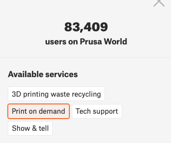
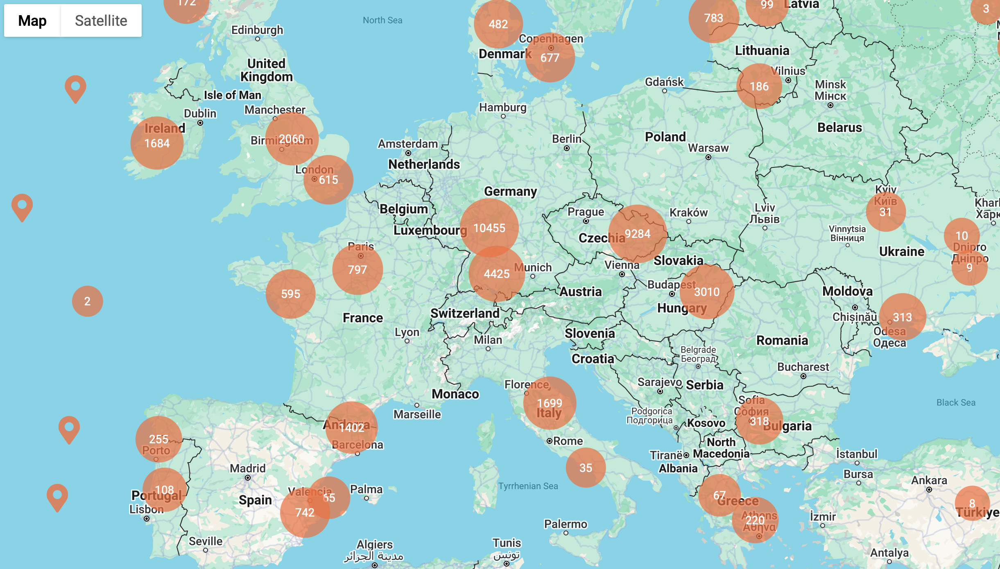

# 3D Printing Services

There are different ways to get your parts 3D printed, below are the options and which one to choose. We will add more services once we verify them. If you tried another service please let us know so we can add it here.

For those who want to connect with other makers and get their 3D printed parts affordably:
- [Community](#prusa-world)

For those who prefer using a professional 3D printing service:
- [Commerical services](#commercial-services)

## Prusa World
**Prusa World** is a platform where you can find people with a Prusa 3D printer. This is not a direct service, but it is a way to find people nearby who might want to print your SO100 arms. This is usally cheaper than commercial services and you get the change to meet people who are excited about 3D printing and building things. You, need to reach out to them yourself and agree on a price.

Go to [Prusa World](https://world.prusa3d.com) and select the option `Print on demand`. Then find people nearby who own a Prusa 3D printer and send them a message via `Send a message` to ask if they would like to print the SO100 arms for you. You can refer them to this repo for the 3D printing files and instructions. Please make sure you have a good agreement with the person in case anything goes wrong and they don't keep their promise or if the print fails, discussing these things beforehand helps in preventing miscommunications. Furthermore, we advise printing with PLA+ instead of PLA and our experience tells us that it matters to use PLA+ because PLA can in some cases not be strong enough to use in the SO100 arm.

## Commercial services

- [Europe](#pcbway)
- [US](#pcbway)
- [China](#pcbway) (PCBWay)

### PCBWay 
**PCBWay** ships worldwide but outside of China import taxes should be paid. This makes it more expensive to order here.

To get your parts made you can go to [pcbway.com](https://www.pcbway.com/rapid-prototyping/manufacture/?type=2) and upload these two files `stl_files_for_3dprinting/Leader/Print_Leader_SO_ARM100_08k_Ender.STL` and `stl_files_for_3dprinting/Follower/Print_Follower_SO_ARM100_08k_Ender.STL` here:

Then select the following settings:
- `Quantity` = 1 for both (Or more if you need more).
- `Design Units` = mm
- `Material` -> Custom material -> and type `PLA+`
- `Product Desc` -> DIY Entertainment -> Robot components
- `Other special requests` =  'FDM, 20% infill' (And you can specify the color you want)

This tells PCBWay we want to use [FDM](https://www.hubs.com/knowledge-base/what-is-fdm-3d-printing/) 3D printing process with 20% infill. You don't need to change the rest of the options. And once you verified everything you can click `Submit`.

Now the parts will be verified and you will be given a final quotation with shipping costs. The pricing can vary but our experience was that the total for both a leader and a follower was around ~95,- dollars. You can have contact with PCBWay via their online portal.

