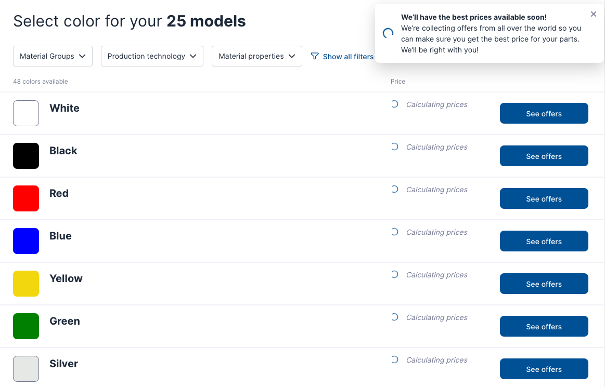

# 3D Printing Services

There are different ways to get your parts 3D printed, below are the options and which one to choose. We will add more services once we verify them. If you tried another service please let us know so we can add it here. Additionaly SeeedStudio also sells the 3D printed parts only: [SO-ARM100 3D-Printed Enclosure](https://www.seeedstudio.com/SO-ARM100-3D-printed-Enclosure-p-6409.html).  

- [Europe](#craftcloud3d) (Craftcloud3d) :fr: :de: :uk: :it: :es:
- [US](#craftcloud3d) (Craftcloud3d) :us:
- [China](#pcbway) (PCBWay) :cn:

### [Craftcloud3d](https://craftcloud3d.com)
**PCBWay** ships worldwide and has partners in different countries that produce the parts. This makes it flexible, although pricing can vary.

To get your parts made you can go to [craftcloud3d.com](https://craftcloud3d.com/upload) and upload all files inside these two folders (25 files in total): `stl_files_for_3dprinting/Individual/Follower` and `stl_files_for_3dprinting/Individual/Leader` here:

Then click `See Materials & Pricing` button, and on the next page select the material. In our case `PLA+`.

Click `Select Material` button and you then have to select the finish. Here choose:
- `Finish` = Standard 
- `Infill` = 20% (If you don't see the infill options, wait until the price is calculated)

And click `Select Finish` to move to the next page.

Next choose the color, and click `See offers`.

Finally choose your manufacturer. You can choose manufacturer based on price, delivery date and production location.

And thats it, once the parts arrive you are ready to assemble your SO100!

### [PCBWay](pcbway.com)
**PCBWay** ships worldwide but outside of China import taxes should be paid. This makes it more expensive to order here.

To get your parts made you can go to [pcbway.com](https://www.pcbway.com/rapid-prototyping/manufacture/?type=2) and upload these two files `stl_files_for_3dprinting/Leader/Print_Leader_SO_ARM100_08k_Ender.STL` and `stl_files_for_3dprinting/Follower/Print_Follower_SO_ARM100_08k_Ender.STL` here:

Then select the following settings:
- `Quantity` = 1 for both (Or more if you need more).
- `Design Units` = mm
- `Material` -> Custom material -> and type `PLA+`
- `Product Desc` -> DIY Entertainment -> Robot components
- `Other special requests` =  'FDM, 20% infill' (And you can specify the color you want)

This tells PCBWay we want to use [FDM](https://www.hubs.com/knowledge-base/what-is-fdm-3d-printing/) 3D printing process with 20% infill. You don't need to change the rest of the options. And once you verified everything you can click `Submit`.

Now the parts will be verified and you will be given a final quotation with shipping costs. The pricing can vary but our experience was that the total for both a leader and a follower was around ~95,- dollars. You can have contact with PCBWay via their online portal.

