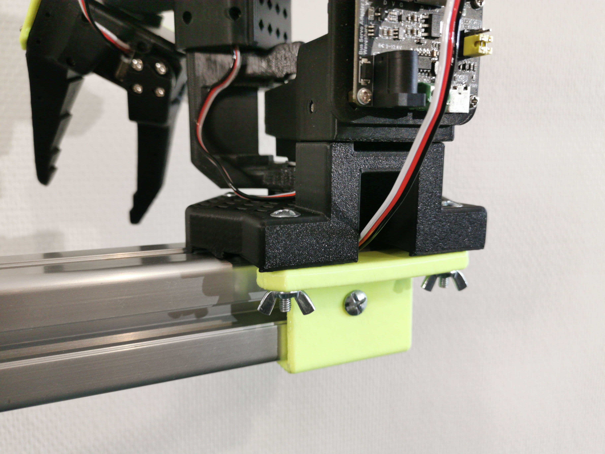
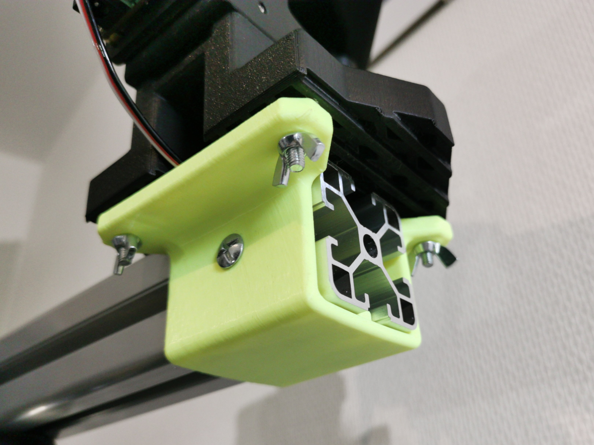
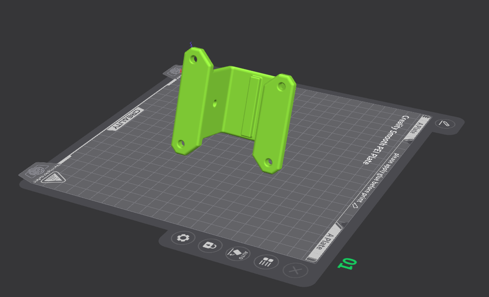

## Base Mount for 4040 Aluminum Profiles

  
  

This 3D-printed adapter allows you to securely attach your **SO-100 base** to standard **40×40 mm aluminum extrusion profiles** (8.2 mm slot width).  
Perfect for building a sturdy, modular platform for your robotic arm.

- 📦 [Download STL](./stl/4040_base_mount.stl)  
- 📐 [Download STEP](./step/4040_base_mount.step)

### 🛠 Assembly Instructions

- Use **1 × M4×16 mm bolt** and **1 × M4 T-nut (8 mm slot)** to attach the adapter to the aluminum profile.  
- Use **4 × M4×30 mm bolts** and **4 × M4 wing nuts** to secure the **SO-100 base** to the mount.  
> The holes are 5 mm in diameter, so M5 hardware can also be used.

### 🖨 Suggested Print Orientation

For optimal strength, print the part in the orientation shown below.  
> Supports are required.

