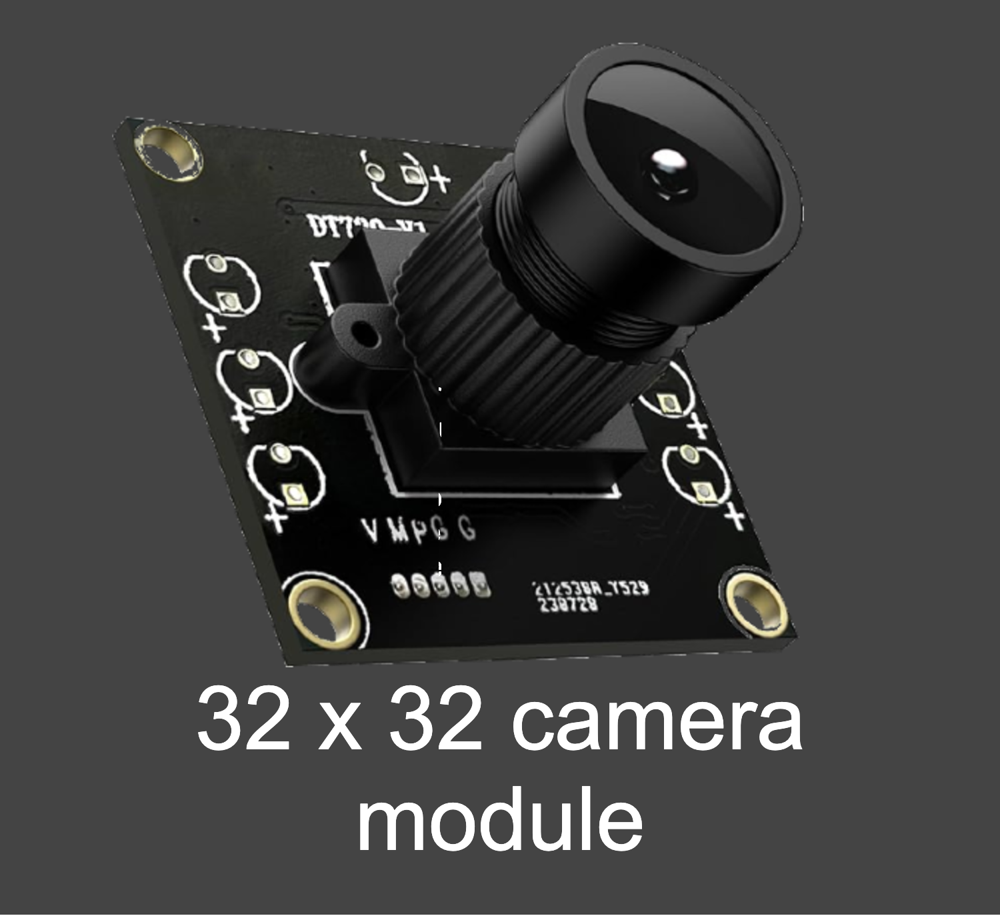
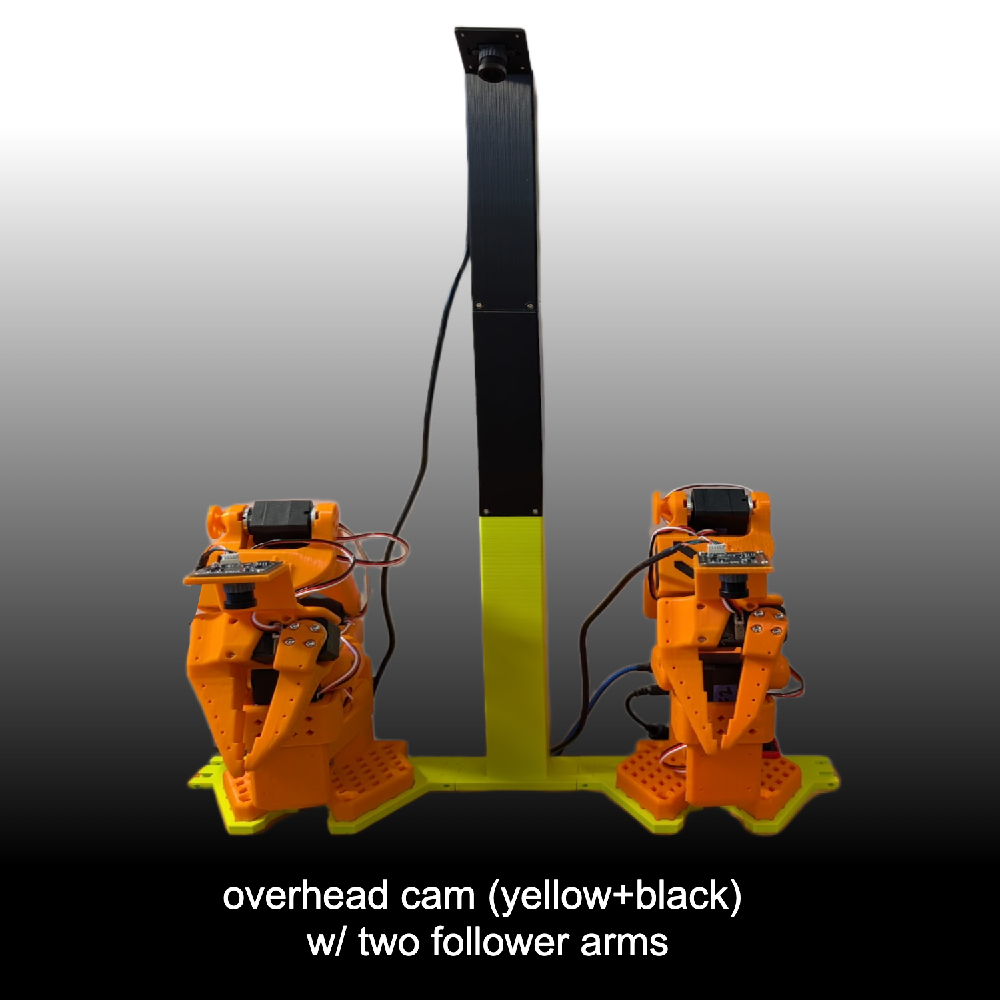
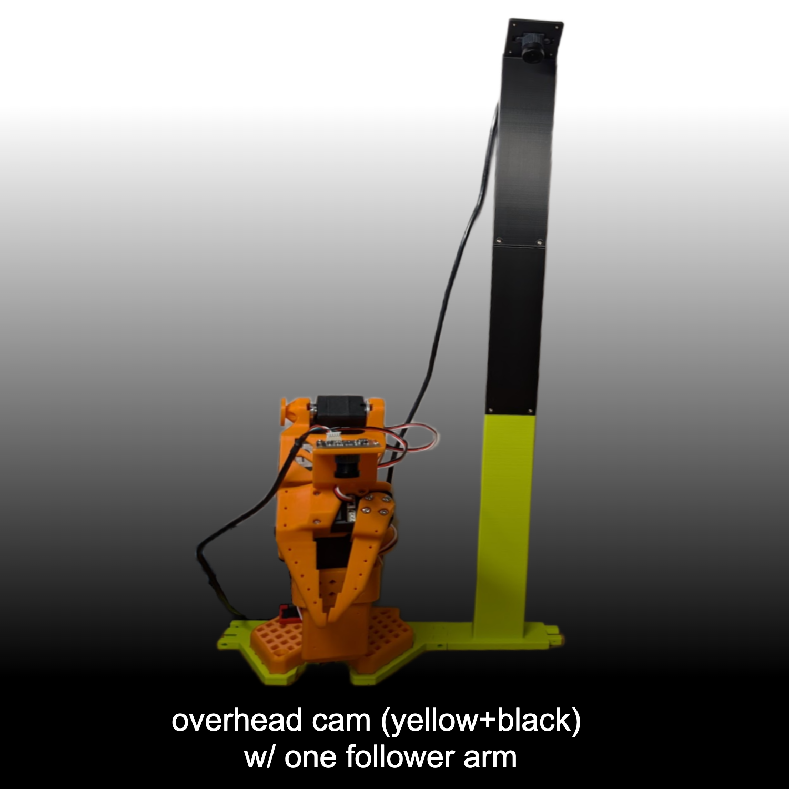
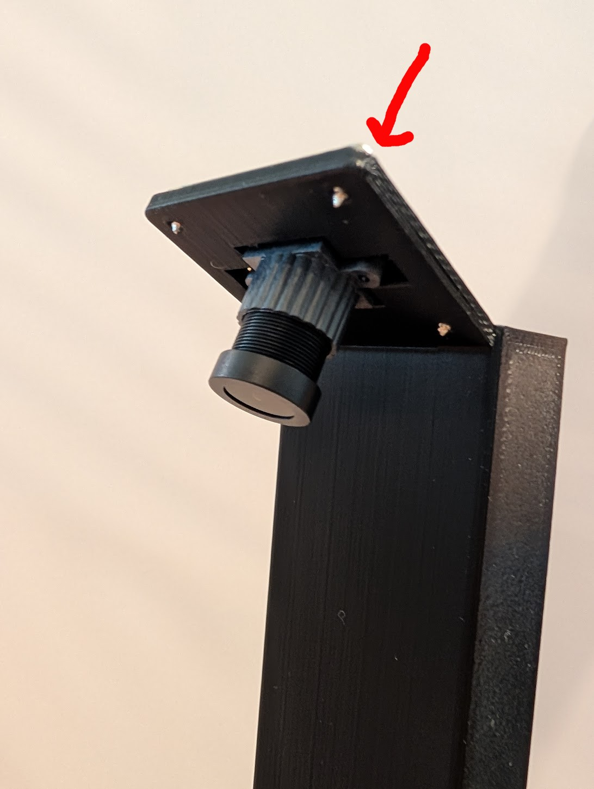
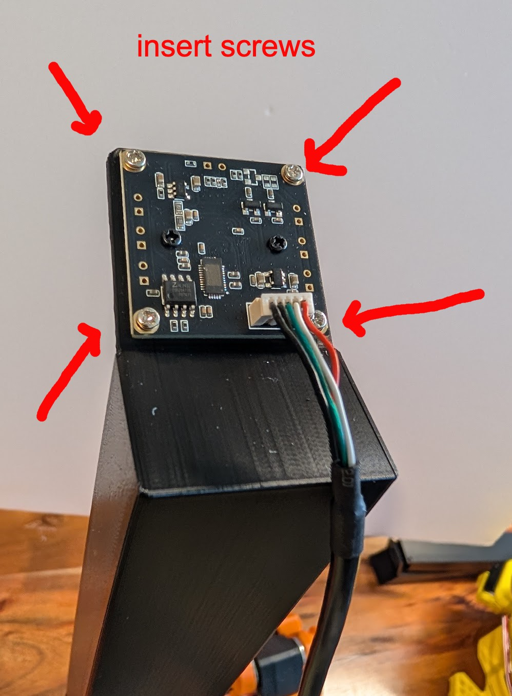
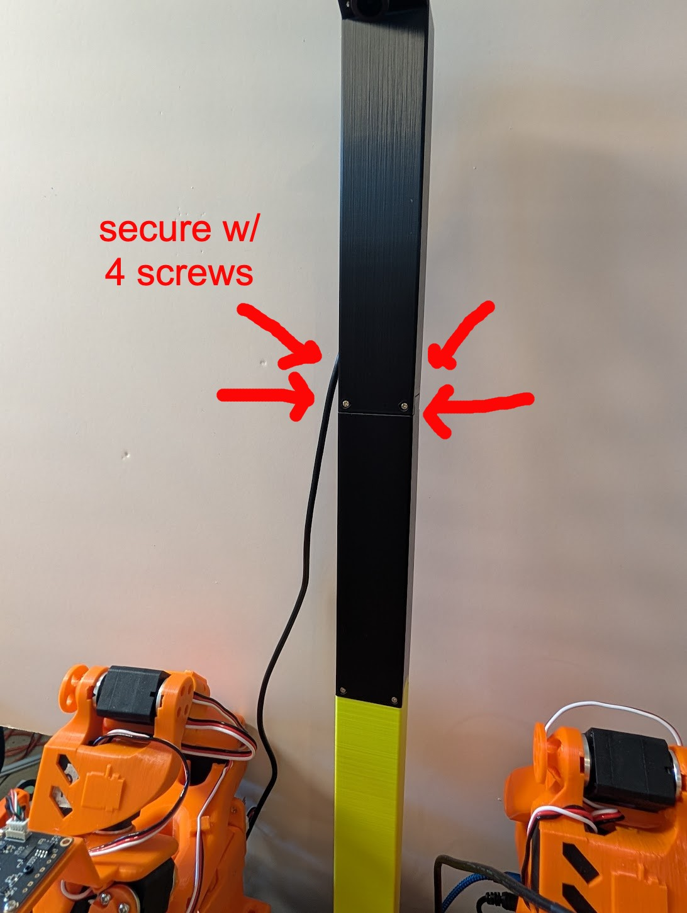
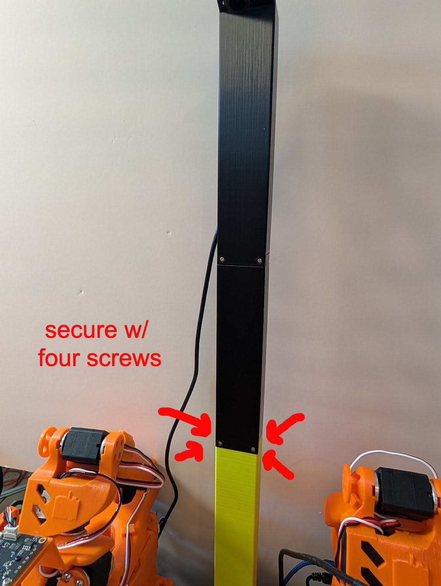

# Overhead Camera (32x32 Camera Module) Installation Guide for SO-100/101

## Overview
This guide provides step-by-step instructions for installing an **Overhead Camera** on the SO-100/101 robot using a **32x32 Camera Module** and a 3D-printed **Arm Base** and **Camera Mount**.

## Related Designs
* [Overhead Camera w/ Webcam Installation Guide](../Overhead_Cam_Mount_Webcam/README.md)

## Design Goals

1. Ensure consistent data across SO-100 arm users through standardized camera positioning and arm spacing (for bi-manual case).
2. Provide an overhead view of entire manipulation space.
3. Support both single follower arm and double follower ("bi-manual") arm setups.

## Required Components
- **Camera Module** (1) - A 32mm x 32mm camera module. This is the [tested / recommended model](https://www.amazon.com/dp/B0CLRJZG8D), but many types are available.
- **3D-printed parts**
    - [Arm Base](stl/arm_base.stl) (1 per follower arm)
    - [Camera Mount Bottom](stl/cam_mount_bottom.stl) (1)
    - [Camera Mount Middle](stl/cam_mount_middle.stl) (1)
    - [Camera Mount Top](stl/cam_mount_top.stl) (1)
- **M2 Screws** (16) - these are the smaller screws that came with your Feetech servos.

## Assembly Instructions

### Step 1: Attach the **Camera Module** onto the **Mount Top**

1. Push the **Camera Module** lens through the hole in **Camera Mount Top**.
  

2. Use 4 screws to secure the **Camera Module** to the **Mount Top**.
  

### Step 2: Attach the **Mount Middle** to the **Mount Top**.

1. Push the **Mount Middle** into the **Mount Top**.
2. Secure with 4 screws.
 

### Step 3: Attach the **Mount Bottom** to the **Mount Middle**.

1. Push the **Mount Bottom** into the **Mount Middle**.
2. Secure with 4 screws.
 

### Step 4: Attach the **Arm Base** to the **Mount Bottom**.
 
1. Push the **Arm Base** into the joint lines on the side of the **Mount Bottom**.  (Repeat if you have 2 follower arms.)
### Step 5: Attach the **Follower arm** to the **Arm Base**.
 
1. Align the bottom of the **Follower arm** with the top of the **Arm Base**. (Repeat if you have 2 follower arms.)
2. If you use clamps to hold down your **Follower arm**, clamp in the same way you've done before, and it will hold down the camera mount.
   
### Step 6: Configure Software 
1. In your software, add your overhead cam, including setting its resolution and FPS. 
- **Common Settings**:
    - FPS: 30
    - Resolution: 640 x 480, or 1280 x 720 if your workspace is wider.  
2. Look at the video feed from your newly installed camera (On Mac, you can also use *QuickTime*->*New Movie Recording* to see this feed).  You should be able to see the workspace of the arm(s).  Set the screen resolution wider if you need to see more of the workspace.

 

### Step 7: (Optional) Add Gripper Cameras
 
1. For optimal training data, add [**Gripper Cameras**](../Wrist_Cam_Mount_32x32_UVC_Module) designed specifically alongside this camera mount setup.

## Acknowledgements

- Conor McGartoll
- Philip Fung

