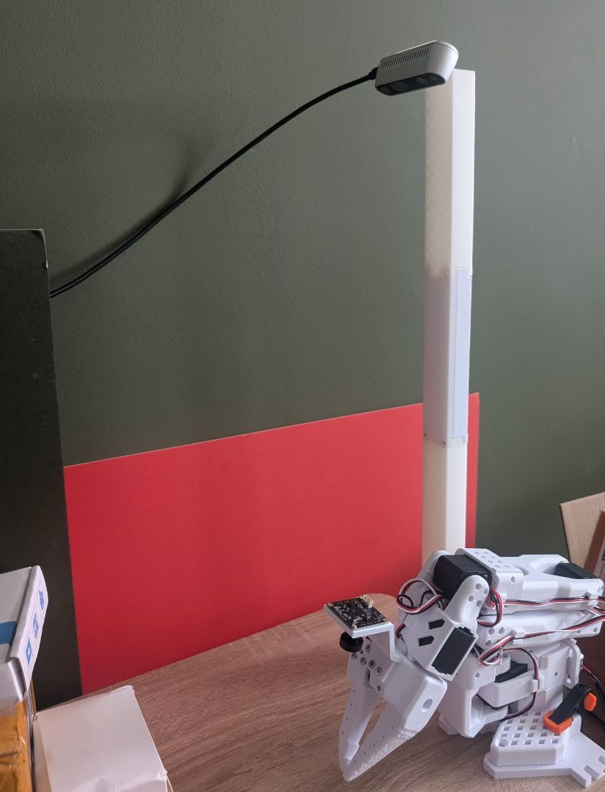
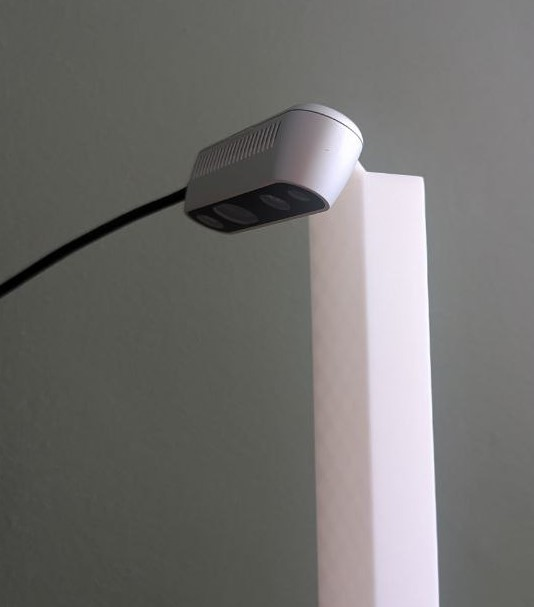

# Overhead Camera (Realsense D435)

This STL is a rough combination of
* [the overhead camera (32x32 Camera Module) top mount](../Overhead_Cam_Mount_32x32_UVC_Module)
* [the wrist-mounted Realsense D435](../Wrist_Cam_Mount_RealSense_D435)

Credits to the original authors.

This STL consists of only the top part of the overhead camera mount. Please navigate to the original overhead camera (32x32 Camera Module) project to print the other parts for assembly.

The different cut parts are also included in the `stl` directory for folks that want to change the angle of the camera.

