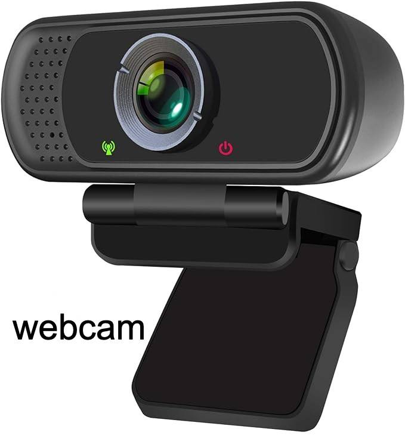

# Overhead Camera (Webcam) Installation Guide for SO-100/101

## Overview
This guide provides step-by-step instructions for installing an **Overhead Camera** on the SO-100 robot using a **Web Camera** and a 3D-printed **Arm Base** and **Camera Mount**.

## Related Designs
* [Overhead Camera w/ 32x32 Camera Module](../Overhead_Cam_Mount_32x32_UVC_Module/README.md)

## Design Goals

1. Ensure consistent data across SO-100 arm users through standardized camera positioning and arm spacing (bi-manual).
2. Provide overhead view of entire manipulation space.
3. Support both single follower arm and double follower ("bi-manual") arm setups.

## Required Components
- **Web Camera** (1) - this is the [recommended model](https://www.amazon.com/dp/B082X91MPP).
- **3D-printed parts**
    - [Arm Base](stl/arm_base.stl) (1 per follower arm)
    - [Camera Mount Bottom](stl/cam_mount_bottom.stl) (1)
    - [Camera Mount Top](stl/cam_mount_top.stl) (1)
- **M2 Screws** (8) - these are the smaller screws that came with your Feetech servos.

## Assembly Instructions
### Step 1: Remove the existing base from the **Webcam**
  
Take the **Webcam** out of its package, and: 
1. Remove the soft plastic cover from the joint.
2. Unscrew/remove the screw in the joint.
3. Remove the base from the camera module.

### Step 2: Attach the **Webcam** onto the **Camera Mount Top**
  

1. Push the **Webcam** into the **Camera Mount Top** by aligning the round joint holes.
2. Place the hex bolt into the hexagon shaped-hole and screw **M2 screw** into the opposite hole of the **Camera Mount Top** round joint.
### Step 3: Attach the **Camera Mount Top** to the **Camera Mount Bottom**.

1. Push the **Camera Mount Top** into the **Camera Mount Bottom** by aligning the linear joint lines on the bottom of **Camera Mount Top** with the top of the **Camera Mount Bottom**.
2. Screw an **M2 screw** into each of the 4 holes in the linear joint.
### Step 4: Attach the **Arm Base** to the **Camera Mount Bottom**.
 
1. Push the **Arm Base** into the joint lines on the side of the **Camera Mount Bottom**.  (Repeat if you have 2 follower arms.)
### Step 5: Attach the **SO-100 follower arm** to the **Arm Base**.
 
1. Align the bottom of the **SO-100 follower arm** with the top of the **Arm Base**. (Repeat if you have 2 follower arms.)
2. If you use clamps to hold down your **SO-100 follower arm**, clamp in the same way you've done before, and it will hold down the camera mount.
   
### Step 6: Configure Software 
1. In your software, add your overhead cam, including setting its resolution and FPS. 
- **Note**: You will likely want to set your resolution to *640 x 480* and FPS to *30* even if the camera module's max resolution/frame rate is higher or wider, as most models work with lower resolutions and any higher will just be data bloat.  This camera mount was specifically designed for 640 x 480 resolution and width.
2. Look at the video feed from your newly installed camera (On Mac, you can also use *QuickTime*->*New Movie Recording* to see this feed).  You should be able to see the workspace of the arm(s).

 

### Step 7: (Optional) Add Gripper Cameras
 
1. For optimal training data, add [**Gripper Cameras**](../Wrist_Cam_Mount_32x32_UVC_Module) designed specifically alongside this camera mount setup.

## Acknowledgements

- Conor Mc Gartoll
    - Design and R & D
- Philip Fung
    - R & D
