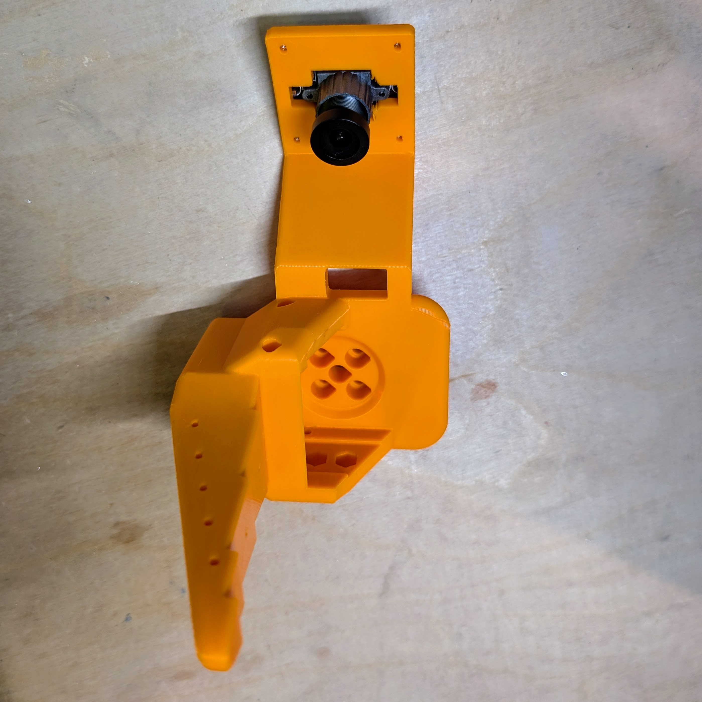
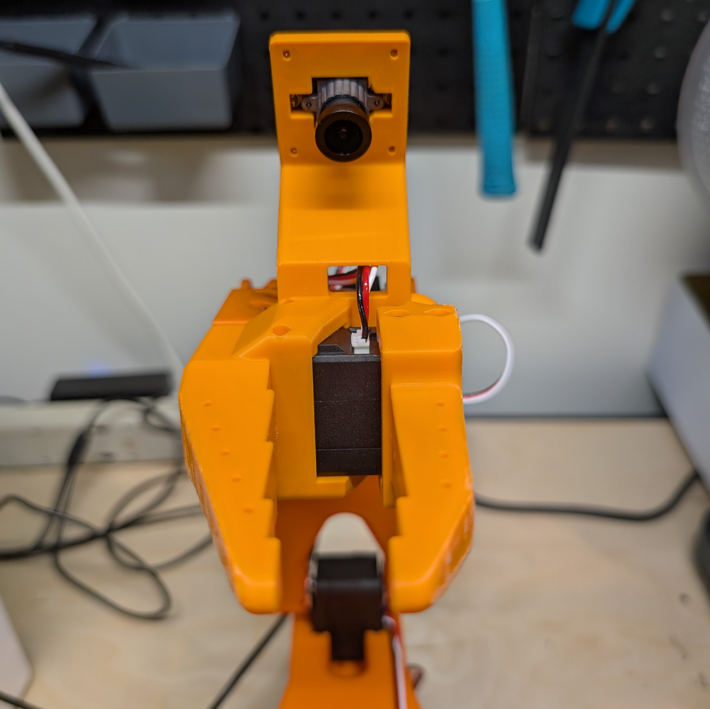

# Wrist Camera Integrated/One-Piece Installation Guide for SO-100/SO-101

 

## Overview
This guide provides step-by-step instructions for installing a **Wrist Camera** on the SO-100/SO-101 robots using a **Camera Module** and a 3D-printed **Jaw Replacement Part**.

## Comparison to Main Design
#### Advantages:
- smaller
- fewer parts
- no additional screws/hardware needed to attach camera

#### Disdvantages:
- requires removal/replacement of existing **Wrist Roll** vs an add-on

## Required Components
### Hardware:
- **USB Camera Module** (1) - this is the [recommended model](https://www.amazon.com/innomaker-Computer-Raspberry-Support-Windows/dp/B0CNCSFQC1/ref=pd_lpo_d_sccl_3/132-7372155-9780230?pd_rd_w=eYz4L&content-id=amzn1.sym.4c8c52db-06f8-4e42-8e56-912796f2ea6c&pf_rd_p=4c8c52db-06f8-4e42-8e56-912796f2ea6c&pf_rd_r=XC3EXZRSSXKDB1G0Z5D7&pd_rd_wg=1wTpn&pd_rd_r=932b1976-9ac7-4cef-9774-f0f9c3acb804&pd_rd_i=B0CNCSFQC1&psc=1), but any 32mm x 32mm USB camera module with min 720p / 30 fps spec will likely work
- 3D-printed Wrist Roll Replacement ([SO-100](/Optional/Wrist_Cam_Mount_32x32_UVC_Module/stl/Wrist_Cam_Mount_32x32_UVC_Module_SO100.stl), [SO-101](/Optional/Wrist_Cam_Mount_32x32_UVC_Module/stl/Wrist_Cam_Mount_32x32_UVC_Module_SO101.stl)) (1)
- **M2 Screws** (4) - these are the smaller screws that came with your Feetech servos.

## Assembly Instructions
### Step 1: Replace the [Wrist Roll](../../STL/SO101/Individual/Wrist_Roll_Follower_SO101.stl) with our new one
1. If a [Moving Jaw](../../STL/SO101/Individual/Moving_Jaw_SO101.stl) is already installed on the arm, leave it attached. Remove the gripper servo from the existing Wrist Roll piece by:
 - unscrewing all 6 of **M3 Screws** from the front and back of the servo which attach it to the Wrist Roll piece 
 - gently pulling the motor out
 - unscrew the remaining 4 **M3 Screws** holding the Wrist Roll piece to the next servo
   
2. 3D print the **Wrist Roll Replacement**.

3. Attach the **Wrist Roll Replacement** by doing the reverse of (1).

### Step 2: Install the Camera
1. Take out the **Camera Module**.
2. Align the 4 holes of the **Camera Module** with the **Moving Jaw Replacement**, and attach using 4 **M2 Screws**.

### Step 3: Configure Software and Adjust Focus
1. In your software, set your resolution and FPS. 
- **Note**: You will likely want to set your resolution to *640 x 480* and FPS to *30* even if the camera module's max resolution/frame rate is higher, as most models work with lower resolutions and any higher will just be data bloat.
2. Turn on your arm.  Look at the video feed from your newly installed camera (On Mac, you can also use *QuickTime*->*New Movie Recording* to see this feed).  
3. **Important** - The focus on the camera is manual and will look very blurry initially. Adjust the focus by twisting the lens counterclockwise or clockwise until the video feed is clear.

## Acknowledgements

Design & Testing
- Conor McGartholl
- Philip Fung