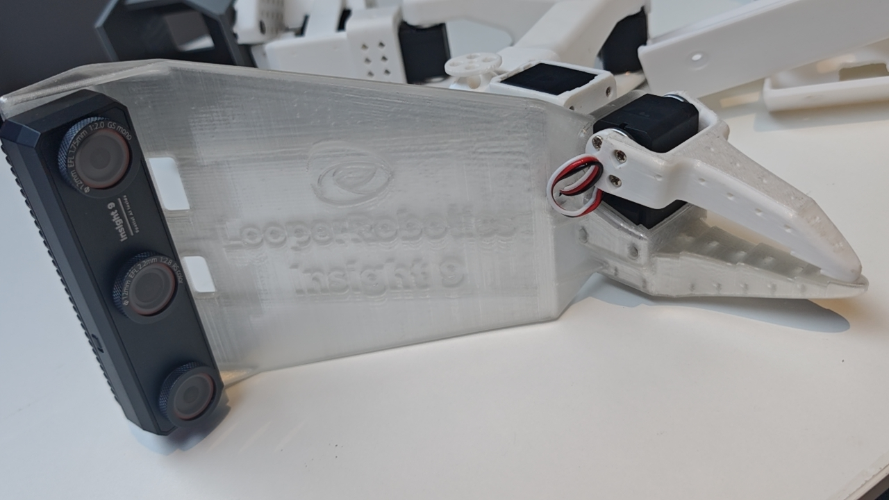

# Wrist Camera Mount for Insight9

A 3D-printed Wrist Roll replacement for the **SO-100** follower arm that integrates the **Insight9** camera.

## Overview

This mount replaces the original Wrist Roll Follower of the SO-100 with a new piece that has a built-in camera mount for the Insight9.

## Required Components

### Hardware
- **Insight9 Camera** (1)
- **M4 Screws** (2) — the smaller screws included with your Feetech servos
- [3D-printed Wrist Roll Replacement](stl/Wrist_Cam_Mount_Insight9.stl) (1)

## Assembly Instructions

### Step 1: Remove the Original Wrist Roll

1. If a Moving Jaw is already installed, leave it attached.
2. Remove the gripper servo (Motor 6) from the existing Wrist Roll piece by:
   - unscrewing all 6 **M3 Screws** from the front and back of the servo
   - gently pulling the motor out
3. Unscrew the remaining 4 **M3 Screws** holding the Wrist Roll piece to the next servo and remove it.

### Step 2: Install the New Wrist Roll

1. 3D print [Wrist_Cam_Mount_Insight9.stl](stl/Wrist_Cam_Mount_Insight9.stl).
2. Attach the new Wrist Roll by reversing Step 1 — secure it to the next servo with 4 **M3 Screws**, then reattach Motor 6 with 6 **M3 Screws**.

### Step 3: Install the Camera

1. Align the Insight9 camera with the mount holes on the new Wrist Roll.
2. Fasten using 2 **M4 Screws**.

### Step 4: Configure Software

In your software, configure the camera resolution and frame rate as required by your pipeline.
