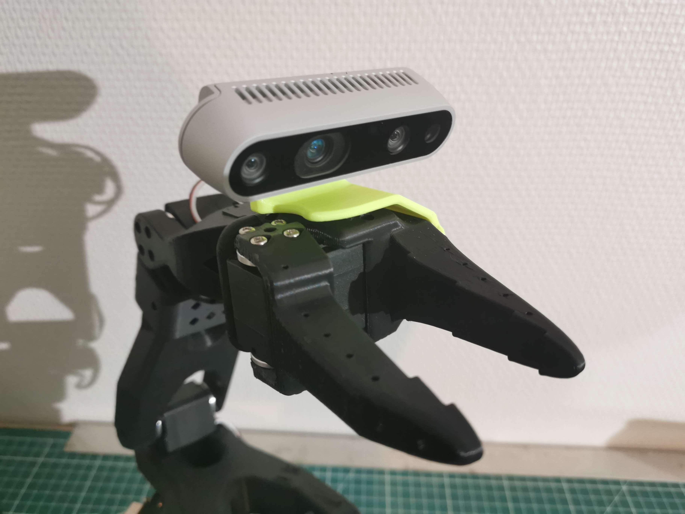
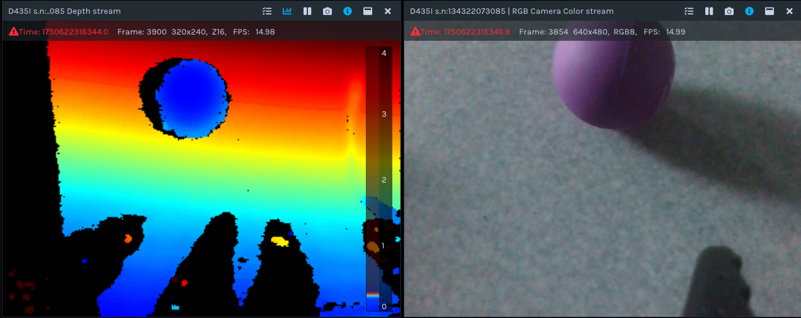
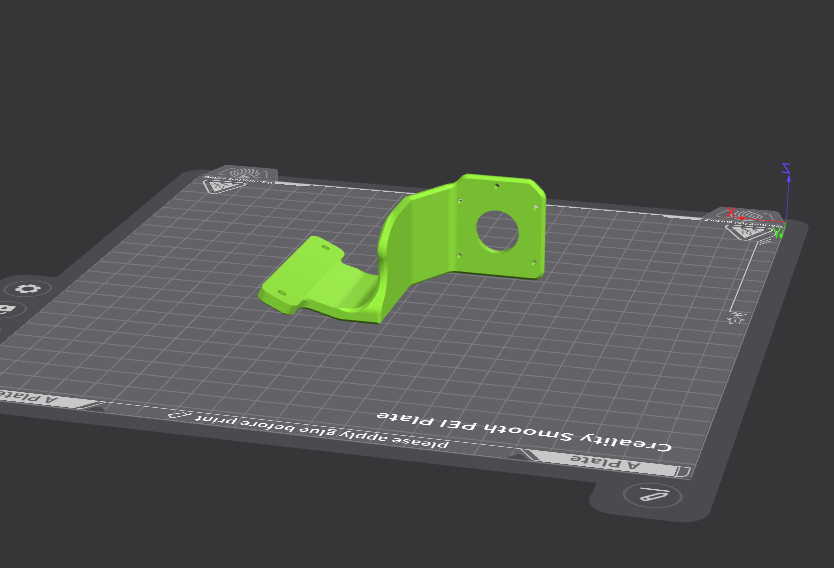
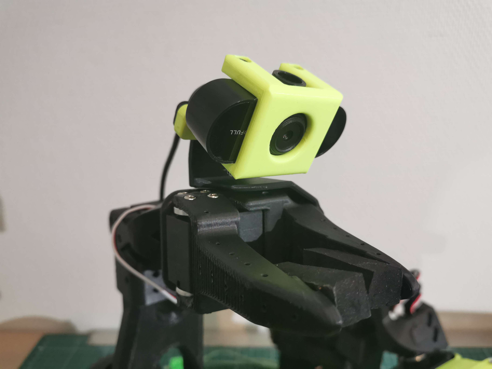

# Wrist Camera Mount for Intel® RealSense™ D435/D435i

This 3D-printed mount lets you easily attach an Intel® RealSense™ D435 or D435i to the **SO-100 wrist** — no modifications or extra hardware required.  
You can reuse the spare screws included with the Feetech servos.

👉 [Download the STL file](stl/Wrist_cam_mount_RealSense_D435.stl)

### Assembly Instructions

- Use **5 small screws** to attach the mount to the SO-100 wrist.  
- Use **2 M3*6mm screws** to secure the Intel camera to the mount.

### Camera Field of View  

> 📝 The camera is centered for **depth sensing**, but can also function with **RGB only**.

### Suggested Print Orientation  

## Vinmooog  Adapter (Optional)

You can also use this mount with a **Vinmooog camera** using the adapter below:

👉 [Download the STL file](stl/D435_Vinmooog_adapter.stl)

