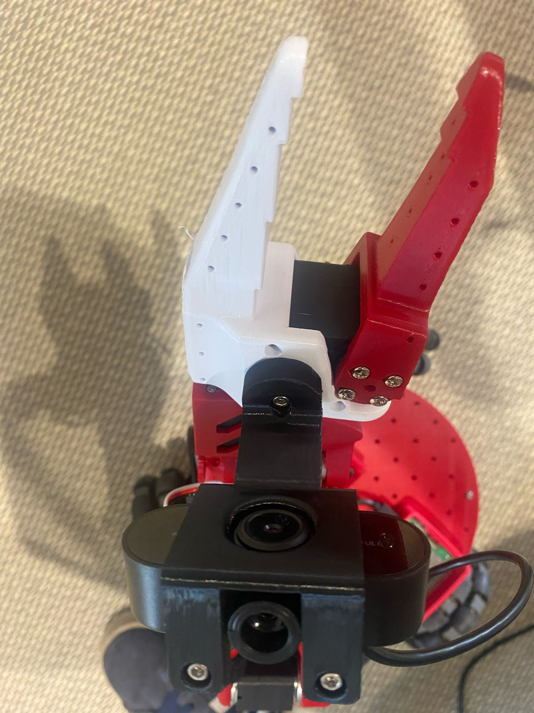

# Wrist Camera Installation Guide for SO100

## Overview
This guide provides step-by-step instructions for installing a **wrist camera** on the SO100 robot using a **cheap webcam** and 3D-printed mounting parts.

## Required Components
### Hardware:
- [Vinmooog Webcam](https://www.amazon.fr/Vinmooog-equipement-Microphone-Enregistrement-conf%C3%A9rences/dp/B0BG1YJWFN/)
- **3D-printed parts:**
  - [Modified wirst](Optional/Wrist_Cam_Mount_Vinmooog_Webcam/stl/Updated_Wrist_Camera_Insert.stl) (Print **1x**), not needed for SO-101
  - [Mount](Optional/Wrist_Cam_Mount_Vinmooog_Webcam/stl/Webcam_Mount_Wrist.stl) (Print **1x**)
- **Fasteners:**
  - 3x **M3 Nut**
  - 1x **M3x12mm bolt**
  - 2x **M3x35mm bolts**

## Assembly Instructions
### Step 1: Print and Prepare the Gripper Mount
1. 3D print the new **SO100 gripper with camera mount**.
2. Insert an **M3 nut** into the dedicated slot in the 3D-printed part.
3. Insert the **motor** into the gripper mount and attach the **gripper mechanism**.

    

### Step 2: Attach the Camera Mount
1. Take the **3D-printed camera mount**.
2. Use an **M3x12mm bolt** to secure the camera mount to the **gripper mount**, ensuring that it locks into the previously inserted **M3 nut**.

### Step 3: Install the Camera
1. Insert the **Vinmooog webcam** into the camera mount.
2. Use **two M3x35mm bolts** to secure the camera from the back and insert the nuts in the slots.

    

