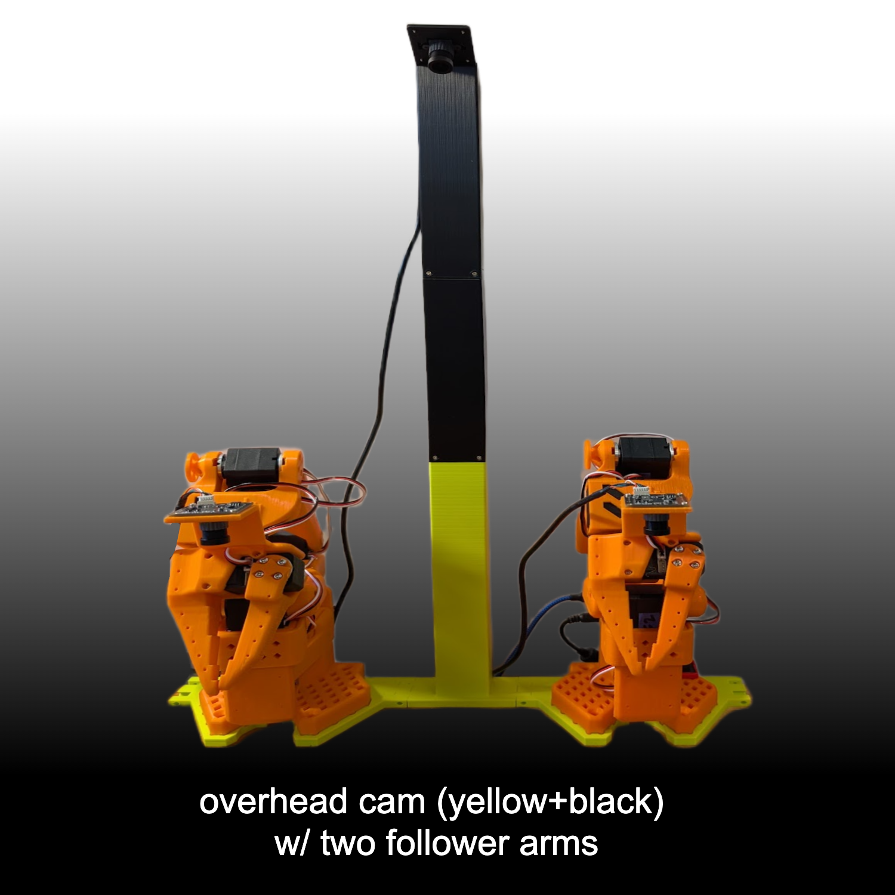
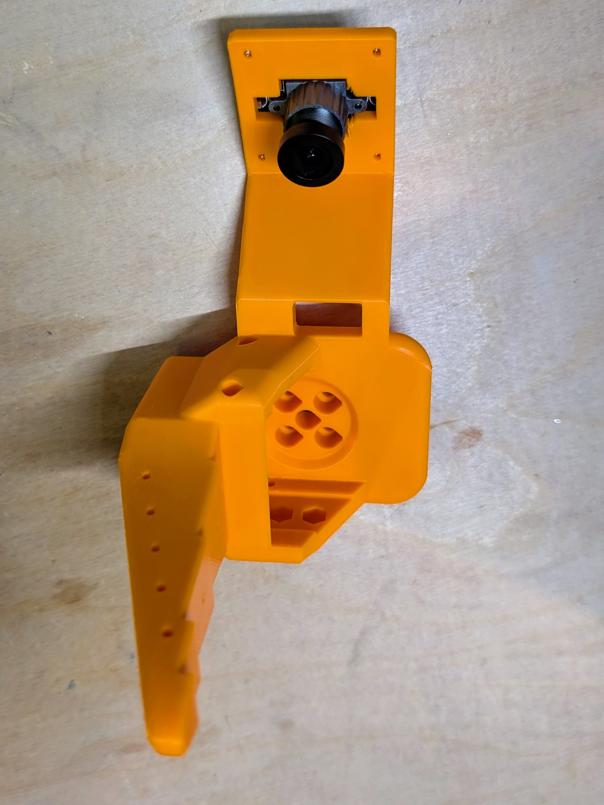
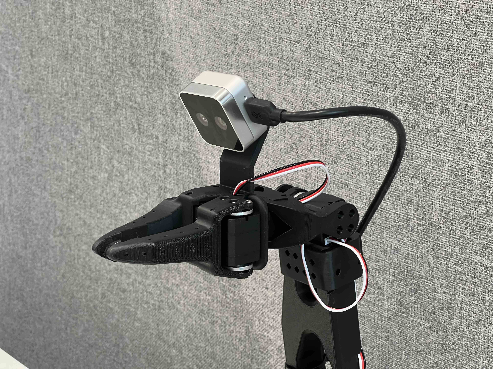
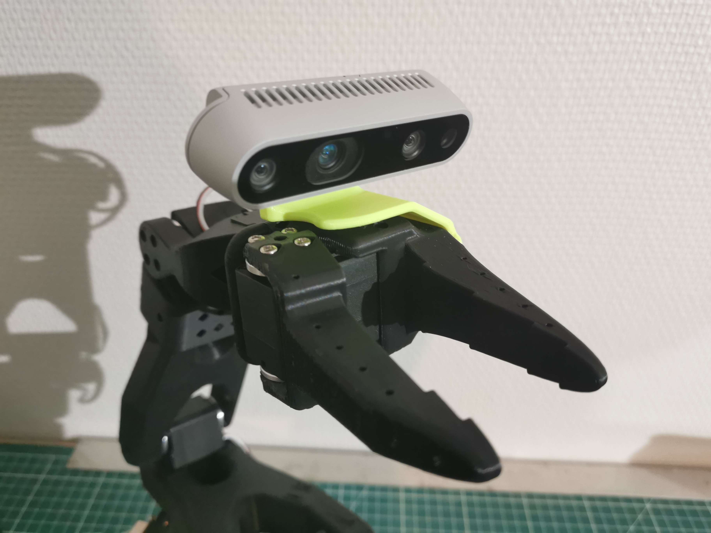

   <h1>Standard Open SO-100 & SO-101 Arms</h1>
   

   
   

<h2>
    
Build Your Own SO-101 Robot!

</h2>

The SO‑101 is the next‑generation version of the SO‑100 robot arm, originally designed by the [RobotStudio](https://www.therobotstudio.com) in collaboration with [Hugging Face](https://huggingface.co/lerobot). It has improved wiring, is easier to assemble (no gear removal) and uses updated motors for the leader arm.

These arms are designed to work seamlessly with the open‑source 🤗 LeRobot library. Join our community on [Discord](https://discord.gg/ggrqhPTsMe) to collaborate on both hardware and software, and help make end‑to‑end AI for robotics more accessible.

### Documentation 📖
- For the SO‑101 docs, follow this page further.
- Here you can find the [SO‑100 docs](SO100.md) which is deprecated.

### Getting Your Own SO‑101 
You have two options:
- **Build it Yourself**
   - Source the components from the [Bill of Materials](#sourcing-parts).
   - 3D print the parts (or order the 3D printed parts), explained in [Printing the Parts](#printing-the-parts).
   - Follow our [Assembly Guide](https://huggingface.co/docs/lerobot/so101).
- **Buy a Kit**
   - Buy assembled arms or a parts kit from one of the vendors [here](#kits).
   - Optionally follow our [Assembly Guide](https://huggingface.co/docs/lerobot/so101).

### Setup with LeRobot 🤗
After sourcing all parts you can setup your SO-101 with LeRobot [tutorial](https://huggingface.co/docs/lerobot/so101). 

### Optional Hardware 🔧
This repository also includes a range of optional hardware designs such as a raised leader base and different camera mounts. Here you can explore the [full list](#optional-hardware).

## Kits

You can find all optional for SO-100/SO-101 kits here:

- from PartaBot :us: [US](https://partabot.com) (They include **assembled** versions, and also sell LeKiwi and Koch robots)
- from Seeed studio :earth_africa: [International](https://www.seeedstudio.com/SO-ARM100-Low-Cost-AI-Arm-Kit.html) or :cn: [China](https://item.taobao.com/item.htm?id=878010637397&skuId=5915703371829&spm=a213gs.v2success.0.0.4cbf4831mkqWLn) or :jp: [Akizuki Denshi](https://akizukidenshi.com/catalog/g/g131169/) or [Aliexpress](https://www.aliexpress.com/item/3256808696884714.html?gatewayAdapt=4itemAdapt) (They include **3d printed kits**)
- from WowRobo :earth_africa: [International](https://shop.wowrobo.com/products/so-arm101-diy-kit-assembled-version-1) or :cn: [China](https://item.taobao.com/item.htm?ft=t&id=860171734711) (They include **assembled** versions)
- from Sudoremove :kr: [South Korea](https://smartstore.naver.com/sudoremove/products/12022333117)
- from NeoBot :cn: [China](https://item.taobao.com/item.htm?ft=t&id=957685951340)

Additionally you can find SO-100 follower arm kit (without leader arm) on [Phospho](https://robots.phospho.ai). It can be especially useful if you own a VR headset.

## Sourcing Parts

The follower and leader arm for this teleoperation setup will almost the same off the shelf parts (except for the motors). If you plan on creating the classic teleoperation set up to be used with the `LeRobot` library please buy from the Parts for Two Arms below. 

We only have links for US, EU, CN, and JP for now. If you find links for other countries, please create an issue or PR so that we add them to the list. Note that prices and items may vary depending on geographic location.

> [!IMPORTANT]  
> The STS3215 motors for the follower arm comes in two sizes. The 7.4V has a stall torque of 16.5kg.cm at 6V (and likely slightly less for a 5V power supply). The 12V version has a stall torque of 30kg.cm. While we found the 7.4V to be sufficient, if you would like more powerful motors you can buy the 12V version [here](https://www.alibaba.com/product-detail/6PCS-12V-30KG-STS3215-High-Torque_1601216757543.html). Note if you do this, you will also have to buy a 12V 5A+ power supply instead of a 5V one. The leader arm is always 7.4V for the SO101.

#### Parts For Two Arms (Follower and Leader Setup):

| Part                                        | Amount | Unit Cost (US) | Buy US                                                                                                    | Unit Cost (EU) | Buy EU                                                                                            | Unit Cost (RMB) | Buy CN                                                                          | Unit Cost (JPY) | Buy JP                                                                          |
| ------------------------------------------- | ------ | -------------- | --------------------------------------------------------------------------------------------------------- | -------------- | ------------------------------------------------------------------------------------------------- | --------------- | ------------------------------------------------------------------------------- | --------------- | ------------------------------------------------------------------------------- |
| STS3215 Servo 7.4V, 1/345 gear (C001) **[2](#leaderbundle)  | 7     | $13.89            | [Alibaba](https://www.alibaba.com/product-detail/Top-Seller-Low-Cost-Feetech-STS3215_1600999461525.html)         | €12.2           | [Alibaba](https://www.alibaba.com/product-detail/Top-Seller-Low-Cost-Feetech-STS3215_1600999461525.html) | ￥97.72         | [TaoBao](https://item.taobao.com/item.htm?id=712179366565&skuId=5268252241438)  | ￥2,980         | [Akizuki Denshi](https://akizukidenshi.com/catalog/g/g116312/)  |
| STS3215 Servo 7.4V, 1/191 gear (C044) **[2](#leaderbundle)   | 2     | $13.89            | [Alibaba](https://www.alibaba.com/product-detail/Feetech-STS3215-SO-ARM101-Servo-7_1601430747897.html?spm=a2747.product_manager.0.0.59a371d2W4e0SR)         | €12.2           | [Alibaba](https://www.alibaba.com/product-detail/Feetech-STS3215-SO-ARM101-Servo-7_1601430747897.html?spm=a2747.product_manager.0.0.59a371d2W4e0SR) | ￥97.72         | -  | ￥2,980         | [Akizuki Denshi](https://akizukidenshi.com/catalog/g/g131131/)  |
| STS3215 Servo 7.4V, 1/147 gear (C046) **[2](#leaderbundle)    | 3     | $13.89            | [Alibaba](https://www.alibaba.com/product-detail/Feetech-STS3215-SO-ARM101-Servo-7_1601430760797.html?spm=a2747.product_manager.0.0.167371d25QeX3F)         | €12.2           | [Alibaba](https://www.alibaba.com/product-detail/Feetech-STS3215-SO-ARM101-Servo-7_1601430760797.html?spm=a2747.product_manager.0.0.167371d25QeX3F) | ￥97.72         | -  | ￥2,980         | [Akizuki Denshi](https://akizukidenshi.com/catalog/g/g131132/)  |
| Motor Control Board                         | 2      | $10.6           | [Amazon](https://www.amazon.com/Waveshare-Integrates-Control-Circuit-Supports/dp/B0CTMM4LWK/)             | €11.4            | [Amazon](https://www.amazon.fr/-/en/dp/B0CJ6TP3TP/)                                               | ￥27            | [TaoBao](https://detail.tmall.com/item.htm?id=738817173460&skuId=5096283384143) | ￥980         | [Akizuki Denshi](https://akizukidenshi.com/catalog/g/g131227/)  |
| USB-C Cable 2 pcs                           | 1      | $7             | [Amazon](https://www.amazon.com/Charging-etguuds-Charger-Braided-Compatible/dp/B0B8NWLLW2/?th=1)          | €7             | [Amazon](https://www.amazon.fr/dp/B07BNF842T/)                                                    | ￥23.9\*2       | [TaoBao](https://detail.tmall.com/item.htm?id=44425281296&skuId=5611379016222)  | ￥1,498         | [Amazon](https://www.amazon.co.jp/dp/B0C3H9L6KZ)  |
| Power Supply    | 2      | $10            | [Amazon](https://www.amazon.com/Facmogu-Switching-Transformer-Compatible-5-5x2-1mm/dp/B087LY41PV/)        | €15.7            | [Amazon](https://www.amazon.fr/-/en/dp/B01HRR9GY4/)                                               | ￥22.31         | [TaoBao](https://item.taobao.com/item.htm?id=544824248494&skuId=4974994129990)  | ￥1,550         | [Akizuki Denshi](https://akizukidenshi.com/catalog/g/g106238/)  |
| Table Clamp 4pcs                            | 1      | $9             | [Amazon](https://www.amazon.com/TAODAN-Trigger-Ratchet-Woodworking-Processes/dp/B0DJNXF8WH?rps=1&sr=1-18) | €9.7 | [Amazon](https://www.amazon.fr/Connex-COXT865210-Lot-Serre-joints-bricolage/dp/B00NA3T2CQ)      | ￥5.2*4 | [TaoBao](https://detail.tmall.com/item.htm?id=801399113134&skuId=5633627126649)                   | ￥2,200         | [Amazon](https://www.amazon.co.jp/dp/B0DJNXF8WH)  |
| Screwdriver Set[1](#myfootnote1) | 1      | $6             | [Amazon](https://www.amazon.com/Precision-Phillips-Screwdriver-Electronics-Computer/dp/B0DB227RTH)        | €9            | [Amazon](https://www.amazon.fr/Vinabo-Magnétique-Electronique-Réparation-Informatique/dp/B0BNQBNFFJ)                                                    | ￥14.9          | [TaoBao](https://detail.tmall.com/item.htm?id=675684600845&skuId=4856851392176) | ￥500         | [Amazon](https://www.amazon.co.jp/dp/B01MDNJVMN)  |
| Total                                       | ---    | $229.88           | ---                                                                                                       | €226.3           | ---                                                                                               | ￥1343.16       | ---                                                                             | ￥44,530         | ---                                                                             |

<a name="leaderbundle">2</a>: You can buy **all six STS3215 servos needed for the SO-101 leader arm**  
(3 × 1/147 gear (C046), 2 × 1/191 gear (C044), 1 × 1/345 gear (C001)) in a single bundle on [Alibaba](https://www.alibaba.com/product-detail/6PCS-7-4V-STS3215-Servos-for_1601428584027.html?spm=a2747.product_manager.0.0.757c2c3clU7uH3).

#### Parts for One Follower Arm:

| Part                                        | Amount | Unit Cost (US) | Buy US                                                                                                                                                | Unit Cost (EU) | Buy EU                                                                                                                                                | Unit Cost (RMB) | Buy CN                                                                          | Unit Cost (JPY) | Buy JP                                                                          |
| ------------------------------------------- | ------ | -------------- | ----------------------------------------------------------------------------------------------------------------------------------------------------- | -------------- | ----------------------------------------------------------------------------------------------------------------------------------------------------- | --------------- | ------------------------------------------------------------------------------- | --------------- | ------------------------------------------------------------------------------- |
| STS3215 Servo 7.4V, 1/345 gear (C001)    | 6      | $13.89            | [Alibaba](https://www.alibaba.com/product-detail/Top-Seller-Low-Cost-Feetech-STS3215_1600999461525.html?spm=a2747.product_manager.0.0.11be71d2ARQb82) | €12.2            | [Alibaba](https://www.alibaba.com/product-detail/Top-Seller-Low-Cost-Feetech-STS3215_1600999461525.html?spm=a2747.product_manager.0.0.11be71d2ARQb82) | ￥97.72         | [TaoBao](https://item.taobao.com/item.htm?id=712179366565&skuId=5268252241438)  | ￥2,980         | [Akizuki Denshi](https://akizukidenshi.com/catalog/g/g116312/)  |
| Motor Control Board                         | 1      | $10.6            | [Amazon](https://www.amazon.com/Waveshare-Integrates-Control-Circuit-Supports/dp/B0CTMM4LWK/)                                                         | €11.4            | [Amazon](https://www.amazon.fr/-/en/dp/B0CJ6TP3TP/)                                                                                                   | ￥27            | [TaoBao](https://detail.tmall.com/item.htm?id=738817173460&skuId=5096283384143) | ￥980         | [Akizuki Denshi](https://akizukidenshi.com/catalog/g/g131227/)  |
| USB-C Cable 2 pcs                           | 1      | $7             | [Amazon](https://www.amazon.com/Charging-etguuds-Charger-Braided-Compatible/dp/B0B8NWLLW2/?th=1)                                                      | €7             | [Amazon](https://www.amazon.fr/dp/B07BNF842T/)                                                                                                        | ￥23.9          | [TaoBao](https://detail.tmall.com/item.htm?id=44425281296&skuId=5611379016222)  | ￥1,498         | [Amazon](https://www.amazon.co.jp/dp/B0C3H9L6KZ)  |
| Power Supply    | 1      | $10            | [Amazon](https://www.amazon.com/Facmogu-Switching-Transformer-Compatible-5-5x2-1mm/dp/B087LY41PV/)                                                    | €15.7            | [Amazon](https://www.amazon.fr/-/en/dp/B01HRR9GY4/)                                                                                                   | ￥22.31         | [TaoBao](https://item.taobao.com/item.htm?id=544824248494&skuId=4974994129990)  | ￥1,550         | [Akizuki Denshi](https://akizukidenshi.com/catalog/g/g106238/)  |
| Table Clamp 2pcs                            | 1      | $5             | [Amazon](https://www.amazon.com/Mr-Pen-Carpenter-Clamp-6inch/dp/B092L925J4/)                                                                          | €8             | [Amazon](https://www.amazon.fr/-/en/dp/B08HZ1QRBF/)                                                                                                   | ￥7.8           | [TaoBao](https://detail.tmall.com/item.htm?id=738636473238&skuId=5505939904942) | ￥2,200         | [Amazon](https://www.amazon.co.jp/dp/B0DJNXF8WH)  |
| Screwdriver Set[1](#myfootnote1) | 1      | $6             | [Amazon](https://www.amazon.com/Precision-Phillips-Screwdriver-Electronics-Computer/dp/B0DB227RTH)                                                    | €9            | [Amazon](https://www.amazon.fr/Vinabo-Magnétique-Electronique-Réparation-Informatique/dp/B0BNQBNFFJ)                                                                                                        | ￥14.9          | [TaoBao](https://detail.tmall.com/item.htm?id=675684600845&skuId=4856851392176) | ￥500         | [Amazon](https://www.amazon.co.jp/dp/B01MDNJVMN)  |
| Total                                       | ---    | $121.94           | ---                                                                                                                                                   | €124.3        | ---                                                                                                                                                   | ￥682.23        | ---                                                                             | ￥24,414        | ---                                                                             |

<a name="myfootnote1">1</a>: You do not need to use this exact screwdriver set, but it is highly recommended to have phillips head screw driver sizes #0 and #1 for easiest screw installation and removal. These are both standard sizes which will likely appear in most small screwdriver sets.

## Printing the Parts

A variety of 3D printers are acceptable to print the parts necessary of the follower and leader arm. Follow the steps below to ensure a good print.

### Step 1: Choose a Printer
The STL files provided are ready to print on many FDM printers. Below are the tested and suggested settings though others may work.
   1. Material: PLA+
   2. Nozzle Diameter and Precision: 0.4mm nozzle diameter at 0.2mm layer height or 0.6mm nozzle at 0.4mm layer height.
   3. Infill Density: 15%
   4. Sample Printers: [Prusa MINI+](https://www.prusa3d.com/product/original-prusa-mini-semi-assembled-3d-printer-4/), [UP Plus 2](https://shop.tiertime.com/product/tiertime-up-plus-2-3d-printer/), [Creality Ender 3](https://www.amazon.com/Comgrow-Creality-Ender-Aluminum-220x220x250mm/dp/B07BR3F9N6/), [Bambu Lab A/P/X-series](https://bambulab.com)

### Step 2: Set up the Printer
   1. Ensure that the printer is calibrated and the bed level is correctly set using the printer specific instructions.
   2. Clean the print bed, making sure it is free from dust, or grease. If cleaning the bed using water, or other liquid, dry the bed.
   3. If your printer recommends it, use a standard glue stick and apply a thin, even layer of glue across the print area of the bed. Avoid clumping or uneven application.
   4. Load the printer filament using printer specific instructions.
   5. Ensure the printer settings match the ones suggested above (most printers have multiple settings so choose the ones that most closely match).
   6. Set for supports everywhere but ignore slopes greater than 45 degrees to the horizontal.
   7. There should be no supports in the screw holes with horizontal axes.
### Step 3: Check Printer Accuracy
   1. In the [Gauges](STL/Gauges) folder, there are two types of gauges, one to check the size of print against a standard 4x2 lego block and one against a STS3215 servo.
      1. If you have a STS3215 servo, print:
         1. [Gauge Zero](STL/Gauges/Gauge_0.STL)
         2. [Gauge Tight](STL/Gauges/Gauge_tight_1.STL)
      2. If you have a standard lego block, print:
         1. [Gauge Zero](STL/Gauges/Lego_Size_Test_02_zero.STL)
         2. [Gauge -0.1](STL/Gauges/Lego_Size_Test_02_minuspoint1.STL)
   2. Test the gauge 0 against your given object (Lego or Servo). The fit should be similar to this [tutorial](https://youtu.be/dss8E3DG2rA).
   3. If the fit is appropriate, go onto Step 4, otherwise, change your printer settings and try again or create an issue.
### Step 4: Print the Parts
All the parts for the leader or follower are for easy 3D printing already contained in a **single file**, correctly orientated for z upwards to minimize supports.
   1. For printer bed sizes of 220mmx220mm (such as the Ender), print these files:
      - [Follower](STL/SO101/Follower/Ender_Follower_SO101.stl)
      - [Leader](STL/SO101/Leader/Ender_Leader_SO101.stl)
   2. For printer bed sizes of 205mm x 250mm (such as the Prusa/Up):
      1. [Follower](STL/SO101/Follower/Prusa_Follower_SO101.stl)
      2. [Leader](STL/SO101/Leader/Prusa_Leader_SO101.stl)

This table contains all individual files:

Individual Part Files

#### Common Parts

| Part                                | Link                                                             |
|-------------------------------------|------------------------------------------------------------------|
| Base_motor_holder_SO101.stl         | [Base_motor_holder_SO101.stl](STL/SO101/Individual/Base_motor_holder_SO101.stl)       |
| Base_SO101.stl                      | [Base_SO101.stl](STL/SO101/Individual/Base_SO101.stl)                                 |
| Motor_holder_SO101_Base.stl         | [Motor_holder_SO101_Base.stl](STL/SO101/Individual/Motor_holder_SO101_Base.stl)       |
| Motor_holder_SO101_Wrist.stl        | [Motor_holder_SO101_Wrist.stl](STL/SO101/Individual/Motor_holder_SO101_Wrist.stl)     |
| Under_arm_SO101.stl                 | [Under_arm_SO101.stl](STL/SO101/Individual/Under_arm_SO101.stl)                       |
| Upper_arm_SO101.stl                 | [Upper_arm_SO101.stl](STL/SO101/Individual/Upper_arm_SO101.stl)                       |
| Rotation_Pitch_SO101.stl            | [Rotation_Pitch_SO101.stl](STL/SO101/Individual/Rotation_Pitch_SO101.stl)             |
| Wrist_Roll_Pitch_SO101.stl          | [Wrist_Roll_Pitch_SO101.stl](STL/SO101/Individual/Wrist_Roll_Pitch_SO101.stl)         |
| WaveShare_Mounting_Plate_SO101.stl  | [WaveShare_Mounting_Plate_SO101.stl](STL/SO101/Individual/WaveShare_Mounting_Plate_SO101.stl) |

#### Leader‑Specific Parts

| Part                  | Link                                     |
|-----------------------|------------------------------------------|
| Handle_SO101.stl      | [Handle_SO101.stl](STL/SO101/Individual/Handle_SO101.stl)     |
| Trigger_SO101.stl     | [Trigger_SO101.stl](STL/SO101/Individual/Trigger_SO101.stl)   |
| Wrist_Roll_SO101.stl  | [Wrist_Roll_SO101.stl](STL/SO101/Individual/Wrist_Roll_SO101.stl) |

#### Follower‑Specific Parts

| Part                            | Link                                                         |
|---------------------------------|--------------------------------------------------------------|
| Moving_Jaw_SO101.stl            | [Moving_Jaw_SO101.stl](STL/SO101/Individual/Moving_Jaw_SO101.stl)                 |
| Wrist_Roll_Follower_SO101.stl   | [Wrist_Roll_Follower_SO101.stl](STL/SO101/Individual/Wrist_Roll_Follower_SO101.stl) |

### Step 5: Remove Supports
   1. After the print is done, use a putty knife to scrape the the parts off the print bed.
   2. Remove any support material from parts.

### Don't Own a 3D printer?
Go here: [Printing services](./3DPRINT.md)

## Optional Hardware
<!--Note: no hardware emoji here so links work correctly-->
Extend your SO‑100/SO‑101 with these add-ons.

Add‑ons

#### 0. XLeRobot

A dual-arm mobile robot for daily use, with 2x SO101 arms, 1x Lekiwi base, 1x 300Wh Anker Battery, 2x wrist RGB cameras, 1x head depth camera (with a 2-dof neck). Total cost 660$.

[→ Full Documentation](https://xlerobot.readthedocs.io/en/latest/index.html), with detailed BOM, 3D printing models, assembly guide, simulation, and teleop guide.

#### 1. Mount Helper  
Print the handy mount jig for easier alignment during assembly.  

[→ View README](Optional/Mount_Helper/README.md)

#### 2. Overhead Camera Mount 

For bird’s‑eye views in single or bi‑manual setups.  
(SO100/101)

| Webcam  | 32×32 Cam Module |
|:---------------------:|:-------------------:|
 |  
| [Instructions](Optional/Overhead_Cam_Mount_Webcam/README.md) | [Instructions](Optional/Overhead_Cam_Mount_32x32_UVC_Module/README.md) 

#### 3. Base Mounts

| Raised Leader Base | 4040 Aluminum Profile Mount |
|:-------------------:|:---------------------------:|
 |   
[Download STL](Optional/Raised_Base/Raised_Base_Extension.stl) | [Instructions](Optional/4040_Base_Mount/README.md)

#### 4. Tactile Sensing (AnySkin)  
Add touch sensing to your gripper.  

[→ Find on WOWROBO](https://shop.wowrobo.com/products/enhanced-anyskin-premium-crafted-editionwowskin)

#### 5. Wrist‑Mount Cameras

| 32×32 UVC Hex Nut (SO101) | 32×32 UVC Integrated (SO100/101) | 32×32 UVC Plug‑on | RealSense D405 | RealSense D435/D435I | Webcam (Vinmooog) |
| --- | --- | --- | --- | --- | --- |
|  |  |  |  |  |  |
| [Instructions](Optional/SO101_Wrist_Cam_Hex-Nut_Mount_32x32_UVC_Module) | [Instructions](Optional/Wrist_Cam_Mount_32x32_UVC_Module/README.md) | [Instructions](Optional/Wrist_Cam_Plug_Mount_32x32_UVC_Module) | [Instructions](Optional/Wrist_Cam_Mount_RealSense_D405) | [Instructions](Optional/Wrist_Cam_Mount_RealSense_D435) | [Instructions](Optional/Wrist_Cam_Mount_Vinmooog_Webcam) |

#### 6. Compliant Gripper
Add some flexibility to your gripper by downloading the compliant gripper parts and printing them using a flexible filament like TPU 95A. 

[→ View README](Optional/Compliant_Gripper/README.md). 

#### 7. Compliant Gripper (new)
Printed with TPU 95A for the finger and PLA for the base. 
Better structure and better grasp (both precision and power). No need to print support for the TPU finger. Requires 2 additional M3 screws, optional 3M gripper tape for higher friction.

[→ Find on XLeRobot](https://github.com/Vector-Wangel/XLeRobot/tree/main/hardware)

## Debugging Motors
For debugging, any Windows PC can connect over USB to program the servos and to debug or do tests. To do so download [Feetech Software](https://www.feetechrc.com/software.html). For Ubuntu, you can use [FT_SCServo_Debug_Qt](https://github.com/Kotakku/FT_SCServo_Debug_Qt). Note: This step is not necessary as motors can be configured using the LeRobot Library, but this can be helpful for debugging.

