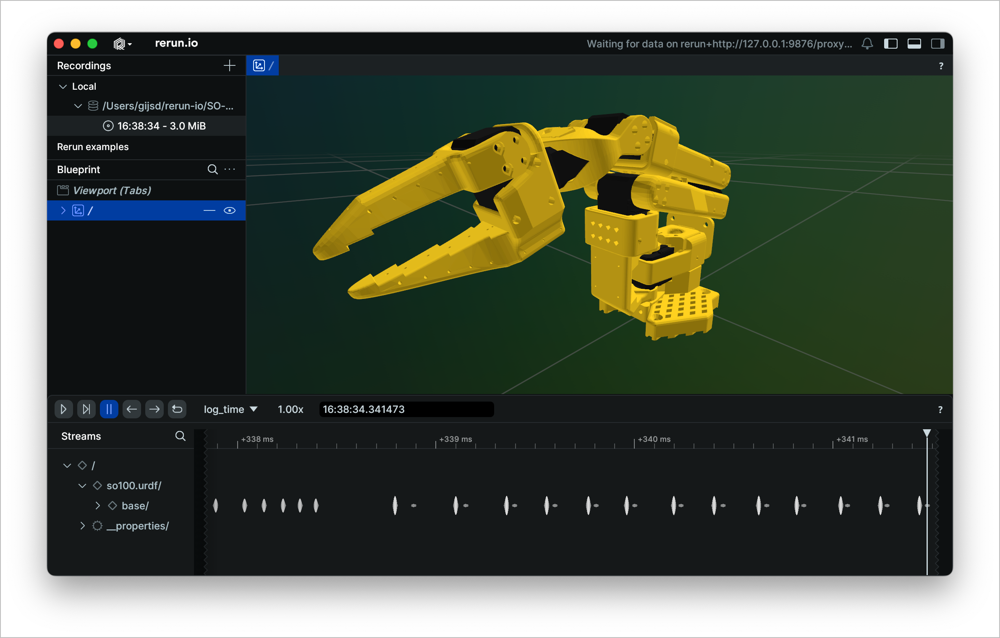

# Simulation Models for SO100 and SO101

This folder contains simulation files for the **SO100** and **SO101**.

## SO100

- Contains a single **URDF** file for the SO100 robot.
- To visualize the **URDF**, you can use [rerun](https://www.rerun.io/) along with the [URDF visualizer plugin](https://github.com/rerun-io/rerun-loader-python-example-urdf#installing-the-plugin)



```bash
rerun Simulation/SO100/so100.urdf
````

## SO101

- Contains both **URDF** and **MJCF** (MuJoCo) files for simulation.
- To visualize the **URDF** files, you can use [rerun](https://www.rerun.io/) along with the [URDF visualizer plugin](https://github.com/rerun-io/rerun-loader-python-example-urdf#installing-the-plugin)

```bash
rerun Simulation/SO101/so101_new_calib.urdf
rerun Simulation/SO101/so101_old_calib.urdf
```

- For more details on:
  - The differences between the **old** and **new calibration** URDFs.
  - How the **MJCF** file was generated from the CAD model.

👉 See the file [`Simulation/SO101/README.md`](Simulation/SO101/README.md).
